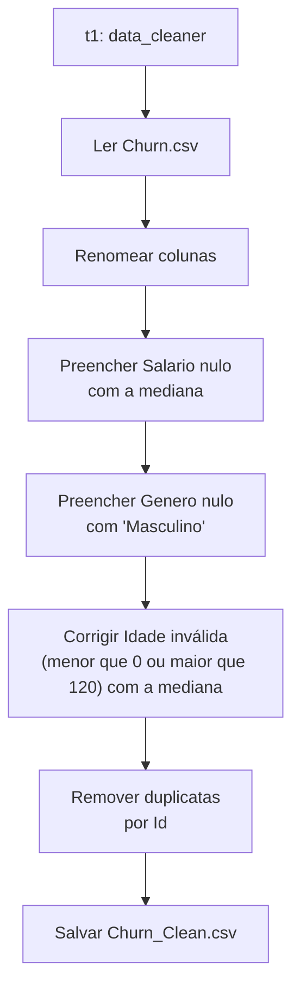

# Apache Airflow — PythonOperator (Limpeza de Dados)

Este exemplo demonstra o uso do **PythonOperator** no Apache Airflow para orquestrar uma rotina de **limpeza de dados (data cleaning)** com `pandas`, aplicada a um dataset de Churn (evasão de clientes).

##  Sobre a DAG

- **Nome:** `pythonoperator`
- **Agendamento:** `schedule_interval=None` (execução manual, sem agendamento automático)
- **Data de início:** `2023-03-05`
- **Catchup:** `False` (não executa runs retroativas)

## Como funciona

A DAG possui uma única task, `t1`, que executa a função `data_cleaner()`. Essa função realiza um processo clássico de tratamento de dados:

1. **Leitura do dataset**
   Lê o arquivo `/opt/airflow/data/Churn.csv`, separado por `;`.

2. **Renomeação das colunas**
   Padroniza os nomes das colunas para: `Id, Score, Estado, Genero, Idade, Patrimonio, Saldo, Produtos, TemCartCredito, Ativo, Salario, Saiu`.

3. **Tratamento de valores nulos**
   - `Salario`: valores ausentes são preenchidos com a **mediana** da coluna.
   - `Genero`: valores ausentes são preenchidos com o valor fixo `"Masculino"`.

4. **Tratamento de outliers**
   - `Idade`: valores inválidos (menores que `0` ou maiores que `120`) são substituídos pela **mediana** da coluna.

5. **Remoção de duplicatas**
   Remove registros duplicados com base na coluna `Id`, mantendo a primeira ocorrência (`keep="first"`).

6. **Exportação do resultado**
   Salva o dataset tratado em `/opt/airflow/data/Churn_Clean.csv`, separado por `;`, sem o índice do pandas.

## 🔀 Fluxo da DAG



## Operadores e bibliotecas utilizados

| Componente | Função |
|---|---|
| `PythonOperator` | Executa a função Python `data_cleaner`, responsável por toda a limpeza |
| `pandas` | Leitura, manipulação e escrita do dataset (CSV) |
| `statistics` | Cálculo da mediana usada para preencher valores ausentes/inválidos |

## Conceitos importantes

- **Task única com lógica encapsulada**: diferente do exemplo de *branching*, aqui toda a transformação acontece dentro de uma única função Python, orquestrada por uma única task (`t1`).
- **Imputação de dados**: uso da mediana em vez da média é uma escolha comum por ser mais robusta a outliers.
- **Idempotência**: como a task sempre lê o mesmo arquivo de origem e sobrescreve o de destino, a execução pode ser repetida com o mesmo resultado.
- **Separação de responsabilidades**: o Airflow aqui atua apenas como orquestrador — quem processa os dados de fato é o `pandas`, dentro da função Python.

## ▶️ Código completo

```python
from airflow import DAG
from airflow.operators.python_operator import PythonOperator
from datetime import datetime
import pandas as pd
import statistics as sts

dag = DAG('pythonoperator', description="pythonoperator",
        schedule_interval=None, start_date=datetime(2023,3,5),
        catchup=False)

def data_cleaner():
   dataset = pd.read_csv("/opt/airflow/data/Churn.csv", sep=";")
   dataset.columns = ["Id","Score","Estado","Genero","Idade","Patrimonio",
        "Saldo","Produtos","TemCartCredito","Ativo","Salario","Saiu"]

   mediana = sts.median(dataset['Salario'])
   dataset['Salario'].fillna(mediana, inplace=True)

   dataset['Genero'].fillna('Masculino', inplace=True)

   mediana = sts.median(dataset['Idade'])
   dataset.loc[(dataset['Idade']<0) | (dataset['Idade']> 120), 'Idade'] = mediana

   dataset.drop_duplicates(subset="Id", keep="first", inplace=True)

   dataset.to_csv("/opt/airflow/data/Churn_Clean.csv", sep=";", index=False)

t1 = PythonOperator(task_id='t1', python_callable=data_cleaner, dag=dag)

t1
```
